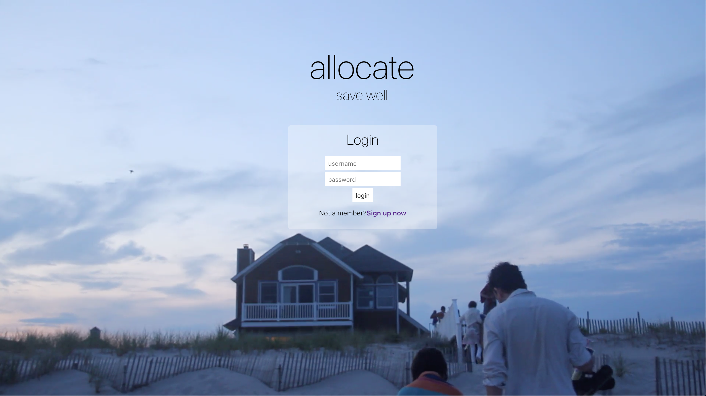
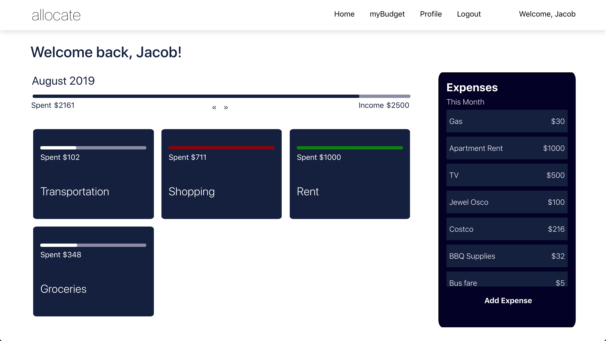
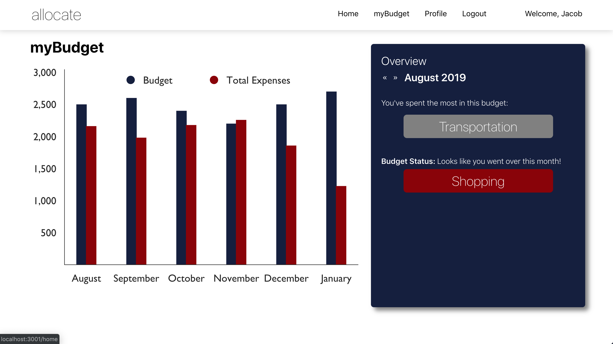
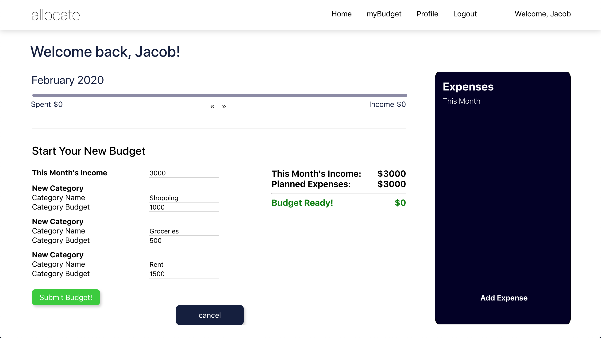

# Analog (Backend)
Personal budgeting app that allows users to create a monthly budget and dynamically displays all the necessary information in their dashboard and on their MyBudget page.

Click here for project's frontend: [Analog (Frontend)](https://github.com/johnlinatoc/allocate-frontend)

Click here for a video demo: [Allocate Video Demo](https://www.youtube.com/watch?v=2tAANzijr40)

## Motivation
After struggling with my own financial illiteracy and discovering a book, [Financial Peace](https://books.google.com/books/about/Financial_Peace_Revisited.html?id=3BhiXcAYgj4C&printsec=frontcover&source=kp_read_button#v=onepage&q&f=false), that helped me understand how to make wiser decisions, I wanted to make a tool that could hopefully help others too. This budgeting app was designed to help others make a budget as easy as possible in the most clearest way I could design. My goal was to allow users to have as little friction as possible when entering expenses and also to have all the necessary info as easy to read as possible.

## Screenshots
Login: 
Main Dashboard: 
MyBudget Page: 
Example of Creating New Budget: 
## Tech/framework used
<b>Built with</b>
- [Ruby on Rails](https://rubyonrails.org/)
- [React](https://reactjs.org/)
- [Bootstrap React for forms](https://react-bootstrap.github.io/components/forms/)
- [Victory Charts for data visualization](https://formidable.com/open-source/victory/)

## Features

Users can add expenses and the dashboard's user interface dynamically changes upon user entries with different relevant indicators.
Users also have a MyBudget section that showcases their spending habits to help them make wiser decisions.

## Installation
Provide step by step series of examples and explanations about how to get a development env running.

## How to use?
If people like your project they’ll want to learn how they can use it. To do so include step by step guide to use your project.

## The MIT License (MIT)

Copyright (c) 2019 John Linatoc

Permission is hereby granted, free of charge, to any person
obtaining a copy of this software and associated documentation
files (the "Software"), to deal in the Software without
restriction, including without limitation the rights to use,
copy, modify, merge, publish, distribute, sublicense, and/or sell
copies of the Software, and to permit persons to whom the
Software is furnished to do so, subject to the following
conditions:

The above copyright notice and this permission notice shall be
included in all copies or substantial portions of the Software.

THE SOFTWARE IS PROVIDED "AS IS", WITHOUT WARRANTY OF ANY KIND,
EXPRESS OR IMPLIED, INCLUDING BUT NOT LIMITED TO THE WARRANTIES
OF MERCHANTABILITY, FITNESS FOR A PARTICULAR PURPOSE AND
NON-INFRINGEMENT. IN NO EVENT SHALL THE AUTHORS OR COPYRIGHT
HOLDERS BE LIABLE FOR ANY CLAIM, DAMAGES OR OTHER LIABILITY,
WHETHER IN AN ACTION OF CONTRACT, TORT OR OTHERWISE, ARISING
FROM, OUT OF OR IN CONNECTION WITH THE SOFTWARE OR THE USE OR
OTHER DEALINGS IN THE SOFTWARE.
